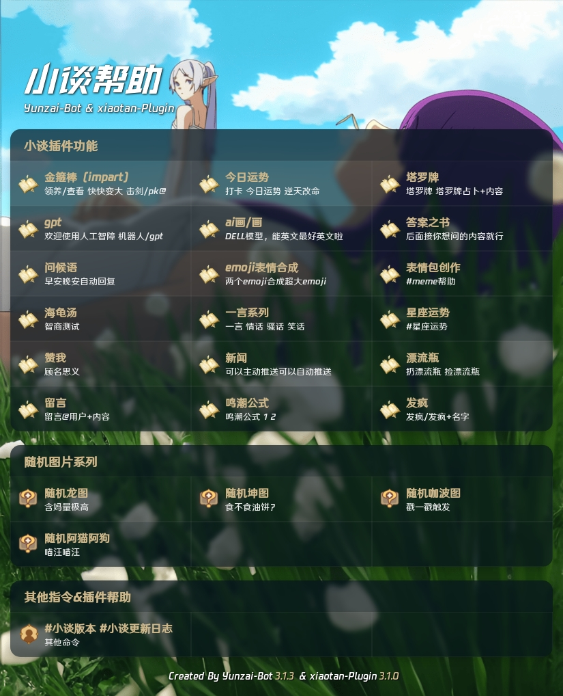

# 插件安装

```sh
#dev分支 v4版
git clone --depth=1 -b dev https://github.com/USYDShawnTan/xiaotan-plugin.git ./plugins/xiaotan-plugin/
```

```sh
#github v3版
git clone --depth=1 https://github.com/USYDShawnTan/xiaotan-plugin.git ./plugins/xiaotan-plugin/
```

```sh
#gitee v3版
git clone --depth=1 https://gitee.com/xioatan/xiaotan-plugin.git ./plugins/xiaotan-plugin/
```

```sh
#安装依赖
npm install pnpm -g
pnpm install
```

# 插件说明

> 部分插件适配了ntqq，所以使用icqq可能导致小bug（比如从回复中找图找不到）




